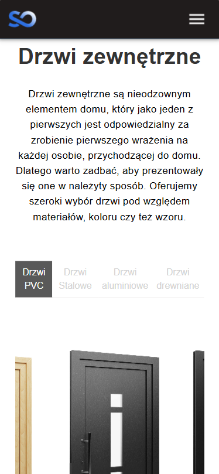
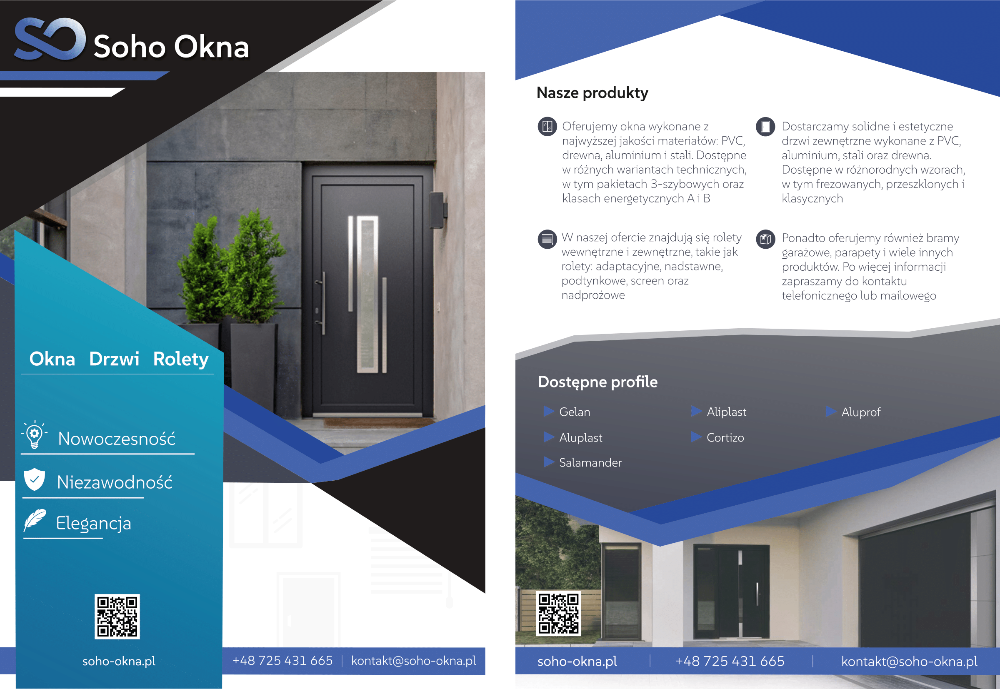

<div><br/> <p align="center">  <h2 align="center">Soho Okna - Website Development and Other IT Services</h2> </p> </div>
Soho Okna is a small company I have been collaborating with since the end of July. Our partnership involved a range of IT services (e.g., domain and email configuration), graphic design work (examples below), and website development. There are plans to create a CMS server, but currently, the website is a static site built using React.

<br>

You can view the current development state <a href="https://sohooknatesting.onrender.com">here</a>.

Currently, <a href="https://soho-okna.pl">soho-okna.pl</a> features only a placeholder page.

## About the website

I handled all the necessary steps to set up a fully functional static website with a custom domain, from configuring the domain and hosting to deploying the website.

![HomePageDesktop]

The website is also fully responsive, ensuring an optimal user experience on both desktop and mobile devices.


<p align="center">  </p>

## Project Structure and React Implementation

The project was developed using the React framework, with TypeScript for scripting. The MUI library was utilized for visually appealing components. Below is an example of how the dynamic display of door names is implemented, based on the selected slide in a carousel.

<br>

### Example scirpt - Dynamic Door Names Based on Type
The doors section is made up of three main elements:
- **OfferingDoorsCarousel** - displays all door types in a carousel format and sets the _CurrentSlide_ state
- **DoorsModelsSection** - displays the currently selected slide (the middle one) with the door's name below it
- **OfferingDoorsSubpage** - Serves as the container for all elements in the carousel
- **DoorsType, DoorsTitles & DoorsPhoto** - mock data files that include the available door types, their corresponding models, and photos
<br>

#### DoorsType, DoorsTitles & DoorsPhoto

``` ts
const DoorsPhoto = {
    [DoorsType.PVC]: [
        doors.PVCClassicLineImg, doors.PVCEkoGreenImg, doors.PVCEkoLineImg,
        doors.PVCEkoVitreImg, doors.PVCModelowePVCImg, doors.PVCNakladkoweImg
    ],
    
    [DoorsType.Aluminiowe]: [
        doors.AluminiumAluLineImg, doors.AluminiumDespiroImg, doors.AluminiumEkoVitreImg
    ],

    [DoorsType.Drewnianie]: [
        doors.DrewnianeEkoVitreImg, doors.DrewnianeWoodLineImg, doors.DrewnianeFrezowaneImg
    ],

    [DoorsType.Stalowe]: []
}

const DoorsTitles = {
    [DoorsType.PVC]: [
        "Panele ClassicLine", "Panele tłoczone EkoGreen", "Panele EkoLine",
        "Panele szklane EkoVitre", "Drzwi modelowe PVC", "Panele nakładkowe"
    ],
    [DoorsType.Aluminiowe]: [
        "Panele AluLine", "Panele aluminiowe Despiro", "Panele szklane EkoVitre"
    ],
    [DoorsType.Drewnianie]: [
        "Panele szklane EkoVitre", "Panele WoodLine", "Panele frezowane"
    ],
    [DoorsType.Stalowe]: [],
}
```

<br>

#### OfferingDoorsCarousel
Here’s a typical implementation of the react-slick carousel. It displays the doors as images in MUI's Paper component. By overriding the _afterChange_ method, we can change the state of the currently displayed slide when it changes.

``` ts
export default function OfferingDoorsCarousel({chosenDoorsType, setCurrentSlide}: {chosenDoorsType: DoorsType, setCurrentSlide: React.Dispatch<React.SetStateAction<number>>})
{
  const settings = {
    infinite: true,
    speed: 800,
    slidesToShow: 1,
    slidesToScroll: 1,
    initialSlide: 0,
    arrows: innerWidth > 980 ? true : false,
    centerMode: true,
    afterChange: (current: number) => {
      //CAUTION: Exception related to proper handling of a center index, of multiple slides
      //CAUTION: For some reason bigger collections of slides, have indexes applied properly
      if(innerWidth > 980 && DoorsPhoto[chosenDoorsType].length <= 4) 
      {
        const middleIndex = (current + 1) % DoorsPhoto[chosenDoorsType].length;
        setCurrentSlide(middleIndex);
        return;
      }
      setCurrentSlide(current); console.log(current);
    },
    responsive: [
        {
            //INFO 1 - edge case, phones like "Z-Fold"
            breakpoint: 360,
            settings: {
              slidesToShow: 1,//1
              centerPadding: '40px'
            },
        },
        // {...}
    ],
    nextArrow: <SampleNextArrow />,
    prevArrow: <SamplePrevArrow />
  };

  return(
      <Box className="slider-container">
          <Slider {...settings}>
            {DoorsPhoto[chosenDoorsType].map((element, index) => ( 
              <Paper 
                key={index}
                elevation={0} sx={{
                backgroundImage: `url(${element})`,
                backgroundSize: 'cover',
                backgroundPosition: 'center',
                backgroundRepeat: 'no-repeat',
                height: {xs: '450px'}
                }}/>
            ))}
          </Slider>
      </Box>
  );
}
```
<br>

#### DoorsModelsSection
This component displays the name and description of the selected door based on the currentSlide value and the chosenDoorsType

``` ts
function DoorsModelsSection({currentSlide, chosenDoorsType, setCurrentSlide}:
 {currentSlide: number, chosenDoorsType: DoorsType, setCurrentSlide: React.Dispatch<React.SetStateAction<number>>}) 
{
    return(
        <>
            <OfferingDoorsCarousel 
                chosenDoorsType={chosenDoorsType} 
                setCurrentSlide={setCurrentSlide}
                />
            <Typography 
                color="#333333" 
                fontWeight={550} 
                fontSize={25} 
                alignSelf={'center'} 
                textAlign={'center'}
                >
                {DoorsTitles[chosenDoorsType][currentSlide]}
            </Typography>

            <DoorsDescriptionSection 
                currentSlide={currentSlide} 
                chosenDoorType={chosenDoorsType} 
                />
        </>
    );
}
```
The OfferingDoorsCarousel component uses the react-slick carousel, and the Typography component displays the door name dynamically based on the selected type. The value is passed to the component as an **Intrinsic Attribiute**.


#### OfferingDoorsSubpage
This container holds the carousel, titles, description, and buttons to select the door type.

``` ts
export default function OfferingDoorsSubpage()
{
    const [chosenDoorsType, setChosenDoorsType] = useState<DoorsType>(DoorsType.PVC);
    const [currentSlide, setCurrentSlide] = useState<number>(0);

    return(
        <Stack direction={'column'} width={'100%'}>
                    <SubSubPageTitle 
                    subPageName="Oferta" 
                    subSubPageName={"Drzwi"} 
                    bgImage={skyImage}
                    />

                <Box 
                    width={'85%'} 
                    maxWidth={'1600px'} 
                    alignSelf={'center'} 
                    mt={10} 
                    mb={10}
                    >
                    <Stack gap={5}>

                        {/* Drzwi zewnętrzne */}
                        <Box>
                            <ZewnetrzneDescSection/>
                            <DoorTypeButtonsSection 
                                chosenDoorsType={chosenDoorsType}
                                setChosenDoorsType={setChosenDoorsType} 
                                />
                            <BoxDivider/>
                        </Box>
                        <DoorsModelsSection 
                            currentSlide={currentSlide} 
                            chosenDoorsType={chosenDoorsType} 
                            setCurrentSlide={setCurrentSlide} 
                            />
                        
                        {/* ... Remeaining components ... */}

                    </Stack>
                </Box>

                <DoorsCatalogSection />
                <DoorsColorsSection />
        </Stack>
    );
}
```

## General IT service

In addition to the website hosted on a custom domain, I also set up a custom email address (kontakt@soho-okna.pl). This required integrating the domain with the email service provider.

## Marketing materials

I also created the following marketing materials for the company:

### Company logo

<p align="center">
    
</p>

### Bussines card

<p align="center">
    
</p>

### Banner in a bigger format

<p align="center">
    
</p>

### Flyer

<p align="center">
    
</p>

<!-- CONTACT -->
## Contact

Jakub Nowak - [@LinkedIn Profile](https://www.linkedin.com/in/jakub-nowak-a245312b7/)
<br/> jakubszymonnowak@gmail.com

<p align="right">(<a href="#readme-top">back to top</a>)</p>


<!-- MARKDOWN LINKS & IMAGES -->
[HomePageDesktop]: Images/SohoOknaHomePageDesktop.png
[DoorsPageMobile]: Images/SohoOknaDoorsMobile.png
